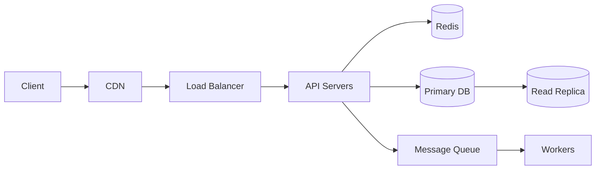

# /design -- Full System Design

End-to-end system design from blank page to production-ready architecture. Chains all 7 HLD phases into a single structured workflow.

## Invocation

```
/design URL shortener for 100M DAU
/design ride-sharing app — 5M daily rides, global, real-time driver tracking
/design notification service for existing social media platform at 50M users
/design                    # asks clarifying questions first
```

## Workflow

### Step 1: Gather Context

Ask the user:
- What system are you designing? (if not provided in arguments)
- Is this for an interview or a real production decision?
- Any hard constraints? (existing tech stack, team size, timeline, cloud provider)
- What do you already know about the scale?

### Step 2: Clarify Requirements

Apply **hld-design Phase 1**:
- Extract 3-5 functional requirements
- Define non-functional requirements (scale, latency, availability, consistency)
- Explicitly state what's out of scope
- Confirm with user: "Before I design, confirm these requirements look right."

### Step 3: Capacity Estimation

Apply **capacity-estimation** skill:
- Work through QPS (reads and writes), storage (3-year horizon), bandwidth, cache size
- State all assumptions explicitly
- Present a summary table with scale implications
- Identify the key bottleneck that will drive architecture decisions

### Step 4: High-Level Architecture

Apply **hld-design Phase 3**:
- Draw the system as a Mermaid diagram (boxes and arrows)
- List every component with its role and technology choice
- Justify each choice with a brief rationale



### Step 5: Data Model

Apply **data-modeling** skill:
- List the core entities
- Design the schema for the primary database
- Identify indexes based on access patterns
- Note embed vs reference decisions if using MongoDB

### Step 6: API Design

Apply **api-design** skill:
- Define the 3-5 most critical endpoints
- Include request/response format, auth, pagination where relevant
- Note versioning strategy

### Step 7: Deep Dives

Pick the 2-3 hardest sub-problems for this specific system and solve in detail:
- What makes this system uniquely hard?
- What would a naive implementation get wrong?
- How does the solution handle the edge cases?

### Step 8: Failure Modes

Apply **hld-design Phase 7**:
- For each major component: what fails, how is it detected, how does it recover?
- Identify the single point of failure and address it
- Define degraded-mode behavior (what still works when DB is down?)

### Step 9: Offer Next Steps

- "Want me to write an ADR for [key decision]? -> `/write-adr`"
- "Should I detail the API contract further? -> `/design-api`"
- "Want the data model expanded? -> `/model-data`"
- "Should I create a deployment plan for this? -> `/deploy-plan`"

## Output

Save a markdown document with:
- Requirements (functional + non-functional)
- Capacity estimates table
- Architecture diagram (Mermaid)
- Component breakdown table
- Data model (schema)
- API contract (key endpoints)
- Deep dives (2-3 sections)
- Failure modes table
- Explicit tradeoffs made

## Interview vs Production Mode

**Interview mode**: move faster, focus on breadth, signal awareness of tradeoffs, don't over-engineer
**Production mode**: go deeper on operational concerns, cost, existing constraints, migration path
