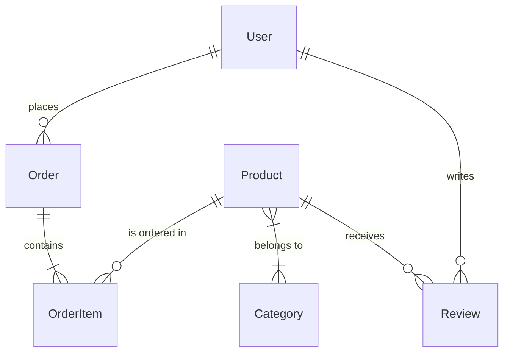

# /model-data -- Data Model Design

Design the data model for a domain, matched to your access patterns. Chains data-modeling with database selection.

## Invocation

```
/model-data E-commerce — products, inventory, orders, reviews, carts
/model-data Blog platform — posts, comments, tags, authors, likes, follows
/model-data Multi-tenant SaaS — tenants, users, roles, subscriptions, features
/model-data                    # asks for domain description
```

## Workflow

### Step 1: Understand the Domain

Extract:
- What are the core entities?
- What's the primary database? (PostgreSQL / MongoDB / DynamoDB — or help them choose)
- What are the dominant read queries? (list 5-10)
- What are the write patterns? (high-frequency small writes vs batch)
- Any compliance requirements? (PII, GDPR right to erasure, audit logging)

### Step 2: Identify Access Patterns

Before any schema work, list every significant query:

```
| Query | Frequency | Latency Target | Notes |
|-------|-----------|----------------|-------|
| Get product by ID | Very High | < 10ms | Cache candidate |
| Search products by category + price range | High | < 100ms | Needs index |
| Get orders for user, newest first | High | < 50ms | Needs compound index |
| Get order with line items | High | < 50ms | JOIN or embed |
```

### Step 3: Design the Schema

Apply **data-modeling** skill:

**For PostgreSQL:**
- Design normalized tables (3NF as starting point)
- Choose primary key strategy (UUID, ULID, or auto-increment)
- Define foreign keys with ON DELETE behavior
- Add created_at, updated_at, deleted_at (soft delete)
- Enumerate all constraints (UNIQUE, CHECK, NOT NULL)

**For MongoDB:**
- For each relationship: embed or reference? State the rule and apply it
- Watch for unbounded arrays
- Note schema validation with Mongoose validators

**For DynamoDB:**
- Design partition key + sort key for every access pattern
- Identify which queries need GSIs
- Apply single-table design where appropriate

### Step 4: Index Strategy

For each significant query, define the supporting index:

```sql
-- Query: orders by user, newest first
CREATE INDEX idx_orders_user_created ON orders(user_id, created_at DESC);

-- Query: products in category, sorted by price
CREATE INDEX idx_products_category_price ON products(category_id, price ASC)
  WHERE deleted_at IS NULL;  -- partial index: exclude soft-deleted

-- Query: full-text search on products
CREATE INDEX idx_products_fts ON products
  USING GIN(to_tsvector('english', name || ' ' || description));
```

Explain for each: query it serves, why this column order, expected selectivity.

### Step 5: Relationships and Cardinality

Draw the ERD (ASCII or Mermaid):



For each relationship, note:
- Cardinality (1:1, 1:many, many:many)
- Cascade behavior on delete
- If many:many: junction table design

### Step 6: Special Concerns

Address as applicable:
- **Soft delete:** `deleted_at TIMESTAMPTZ` column, filter with `WHERE deleted_at IS NULL`
- **Audit log:** separate `audit_events` table or triggers; who changed what and when
- **Multi-tenancy:** tenant_id on every table + row-level security policy (PostgreSQL) or partition key (DynamoDB)
- **Versioning:** event sourcing vs latest-state vs append-only log
- **PII:** which fields are PII, encryption-at-rest, GDPR erasure strategy (null-out vs delete)

### Step 7: Offer Next Steps

- "Should I design the API for this domain? -> `/design-api [resource]`"
- "Want the full system design? -> `/design [system]`"
- "Should I write the Mongoose schema (Node.js)? -> `/mern-schema [domain]`"

## Output

```
## Data Model: [Domain]

### Access Patterns
| Query | Frequency | Latency | Index Needed |

### Entity Relationship Diagram
[Mermaid ERD]

### Schema

#### [Table/Collection Name]
| Field | Type | Constraint | Notes |

[Repeat per entity]

### Index Strategy
| Index Name | Table | Columns | Type | Query It Serves |

### Relationship Notes
[Embed vs reference decisions, cascade behavior, junction tables]

### Special Concerns
[Soft delete, audit, multi-tenancy, PII — whichever apply]

### Tradeoffs
[3-5 explicit: normalization vs performance, consistency vs flexibility, etc.]
```
